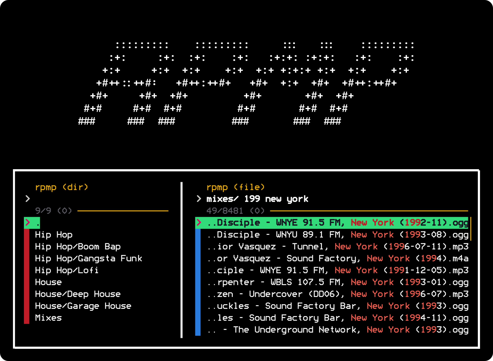

<br>
<h1 align="center">rpmp</h1>

<p align="center">
	<em>A music player project for unix aficionados; designed especially to
	facilitate a screen-free, numpad-controlled playback experience for your
	vehicle's audio system.</em>
</p>

<br>

# Commands

### Default Action

Resume music playback of cached playlist file (`rpmp play`) and display recursive list of subdirectories to play within default music directory or `$RPMP_DPATH_MUSIC` (`rpmp dir`) once playback ends.

```shell
% rpmp
```

### dir, d [-q] [query]

Display recursive list of subdirectories to play within default music directory or `$RPMP_DPATH_MUSIC`.

<table style="width: 100%; border: 0;">
	<tr>
		<td>-q</td>
		<td>Disable selection tone and text-to-speech (tts).</td>
	</tr>
</table>

```shell
% rpmp d
% rpmp d deep house
% rpmp d -q
% rpmp d -q deep house
```

### file, f [query]

Display recursive list of files to play within default music directory or `$RPMP_DPATH_MUSIC`.

```shell
% rpmp f
% rpmp f mixes 199 fm new york
```

### play, p [-qs]

Resume music playback of cached playlist file.

<table style="width: 100%; border: 0;">
	<tr>
		<td>-q</td>
		<td>Suppress initialization tone.</td>
	</tr>
	<tr>
		<td>-s</td>
		<td>Shuffle cached playlist content.</td>
	</tr>
</table>

```shell
% rpmp p
% rpmp p -q
% rpmp p -s
% rpmp p -qs
% rpmp play
```

<br>
<br>
<h3 align="center">Documentation is in development!</h3>

